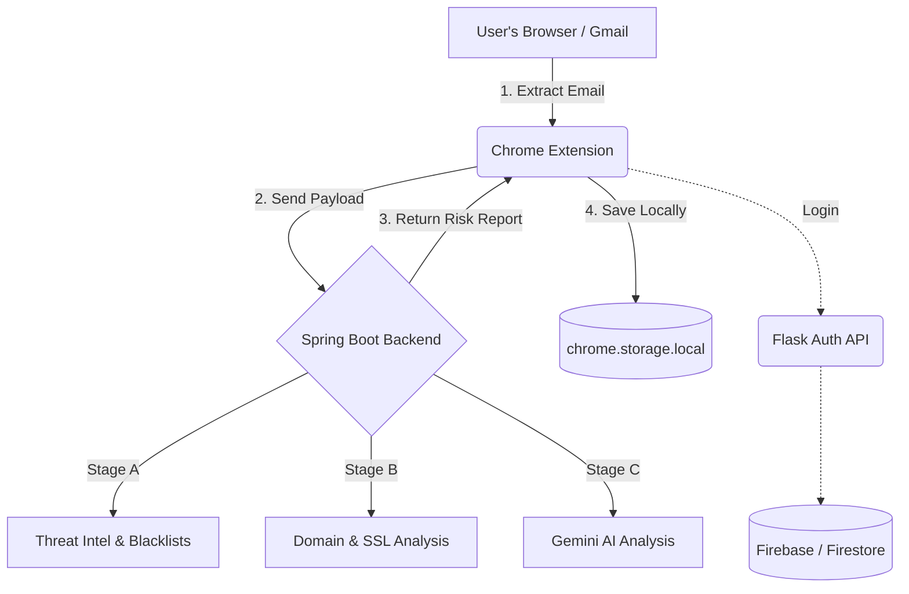

# Nova AI Phishing Detection: How It Works

Nova is a multi-layered, AI-powered phishing detection system designed to scan emails in real-time. This document explains the end-to-end architecture, the journey of an email during a scan, and how each component works together.

---

## 1. System Architecture

The Nova ecosystem consists of four main components:

1. **Chrome Extension (`/extension`)**: The user-facing interface. It injects scripts into Gmail and Outlook to read email content and provides a popup UI to view scan reports and history.
2. **Detection Engine (`/backend/scanner-app`)**: A Spring Boot Java application that acts as the core "brain". It runs a 10-stage detection pipeline on every email, utilizing heuristics, threat intelligence, and AI.
3. **Auth Server (`/Flask-Api`)**: A Python Flask API that manages user registration, JWT token generation, and role-based access control (RBAC), backed by Firebase Authentication and Firestore.
4. **Admin Dashboard (`/web`)**: A React dashboard where administrators can view platform-wide metrics, scan histories, and manage users.



---

## 2. The Journey of a Scan

When a user clicks the "Scan" button on an open email, here is exactly what happens behind the scenes:

### Step 1: Extraction (Chrome Extension)
The content script (`src/content/gmail.js` or `outlook.js`) reads the currently open email in the DOM. It extracts:
- **Sender Details:** `From` address, `Reply-To`, and Display Name.
- **Content:** The email Subject and the HTML/Plain Text body.
- **Links:** All `<a>` tags and explicit URLs found in the body.
- **Headers:** SPF, DKIM, and DMARC authentication results.

### Step 2: Transmission
The extension bundles this data into a JSON payload and sends an HTTP POST request to the Spring Boot backend (`http://localhost:8080/api/phishing/scan`).

### Step 3: The 10-Stage Detection Pipeline (Backend)
The Spring Boot backend receives the payload and passes it through an orchestrated series of independent checks:

1. **URL Extraction:** Identifies all links, even hidden ones.
2. **Redirect Resolution:** Follows URL shorteners (like `bit.ly`) or tracking links up to 10 hops to find the *actual* destination.
3. **Authentication Headers:** Checks if SPF/DKIM/DMARC failed, indicating a spoofed sender.
4. **Threat Intel Blacklists:** Checks URLs against known databases like OpenPhish and PhishTank.
5. **Google Safe Browsing:** Queries Google's real-time malware and social engineering database.
6. **Homograph Detection:** Looks for fake domains using look-alike characters (e.g., `paypa1.com` or Cyrillic characters).
7. **Domain Age (WHOIS):** Checks if the sender's domain or link domains were registered very recently (a common sign of burner phishing domains).
8. **Typosquatting:** Calculates the "Levenshtein distance" to see if the domain is trying to mimic a top 1-million trusted brand.
9. **SSL Inspection:** Verifies the SSL certificate of the links.
10. **Gemini AI Analysis:** Sends the email text to Google Gemini to look for psychological manipulation, false urgency, or credential harvesting language.

### Step 4: Scoring and Assembly
Each stage generates "Findings" with a severity (`LOW`, `MEDIUM`, `HIGH`). 
The backend aggregates these findings, calculates a final Risk Score (0 to 100), and categorizes the email:
* **0-9:** Safe
* **10-29:** Low Risk
* **30-54:** Medium Risk
* **55-74:** High Risk
* **75-100:** Critical Risk

### Step 5: Display and Storage
The backend sends the final JSON report back to the extension.
- The **Popup UI** parses the report and displays it visually to the user.
- The **Background script** saves a copy of the report to the browser's `chrome.storage.local` so it appears in the "History" tab.
- *(If Firestore was enabled, the backend would also log it to the cloud for admins to review).*

---

## 3. Fallback & Offline Capabilities

Nova is designed to be highly resilient:
* **No AI Key?** If the Gemini API key is missing, the backend gracefully skips Stage 10. It still provides a highly accurate score based on heuristics, domain age, and blacklists.
* **No Database?** If Firebase is offline or disabled (`firebase.enabled=false`), the backend skips saving global history. The Chrome extension compensates by saving the history locally on the user's machine.
* **No Network?** If a specific threat feed (like OpenPhish) is down, the backend uses a locally cached CSV fallback file.

---

## 4. Quick Start: Running Locally

To run the Spring Boot detection engine on your local machine, open your terminal, navigate to the backend directory, and run the Maven wrapper:

```powershell
cd backend/scanner-app
.\mvnw spring-boot:run "-Dmaven.test.skip=true"
```

This will start the scanner on `http://localhost:8080`, ready to receive payloads from the Chrome extension.
